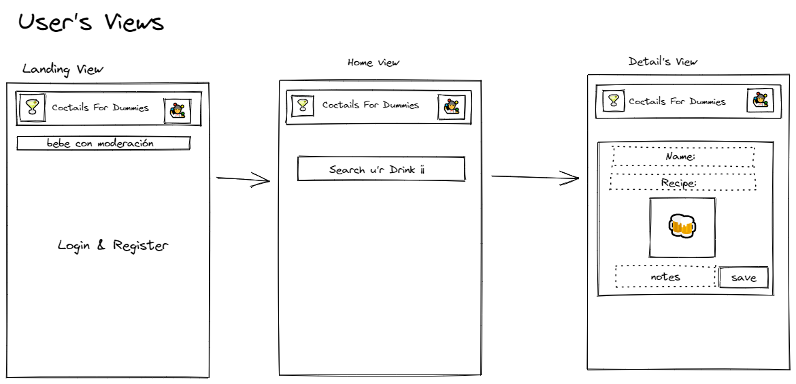

# Coctail's For Dummies

## Presentación

Coctail's For Dummies(CFD) es una APP que consiste en acercar al usuario medio el fantástico mundo de la coctelería profesional. Dentro de CFD encontraremos un completo buscador de cocteles clásicos, modernos y sin alcohol.

CFD ofrece un completo listado de recetas, detallado en centilitros y onzas, aprobados por IBA junto con la descripción del proceso para realizarlo.

La experiencia CFD permite al usuario crear y guardar sus  recetas favoritas y añadir comentarios al recetario.

## Intro
Coctail's For Dummies(CFD) is an APP that consists of bringing the fantastic world of professional cocktails closer to the average user. Within CFD we'll  find a complete search engine for classic, modern and non-alcoholic cocktails.

CFD offers a complete list of recipes, detailed in centiliters and ounces, approved by IBA, together with the description of the process to carry it out.

The CFD experience allows the user to create and save their favorites and add comments to the recipes.

## Functional Description

### Activities
Como usuario podrás:

- Buscar cócteles en la app
- Listar cócteles
- Ver detalles de cócteles y su receta
- Añadir comentarios a los cócteles

### Use Cases

#### Flows

#### User Interface (UI)

##### Main Views

## Technical Description

### Blocks

### Data Model

User
- userId
- name (string, required,unique, min length 8)
- email (string, required, unique, without space)
- password (string, required, min length 8)
- favs ([ObjectId], unique))

Recipe
- id
- Name (string, required, unique)
- description (string, required)
- recipe (string, required)
- comments (string, required)
- photo (string, unique)

Comments
- text
- id 
- user

