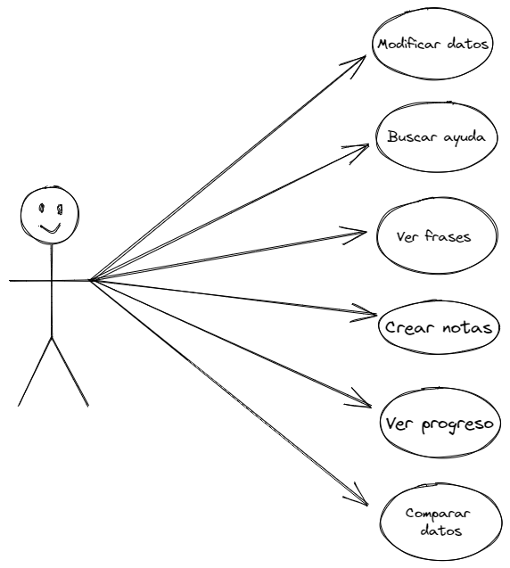
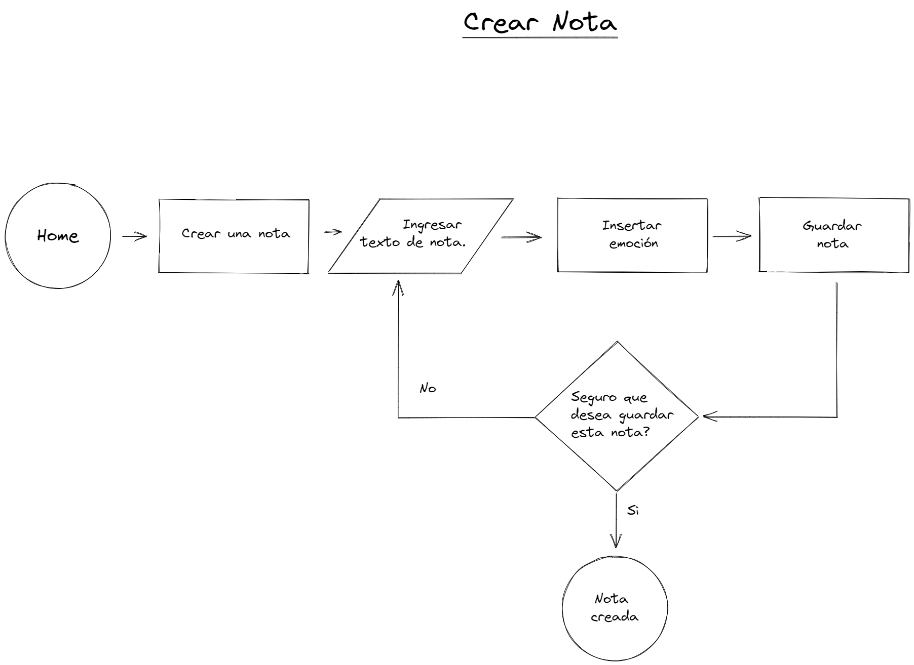
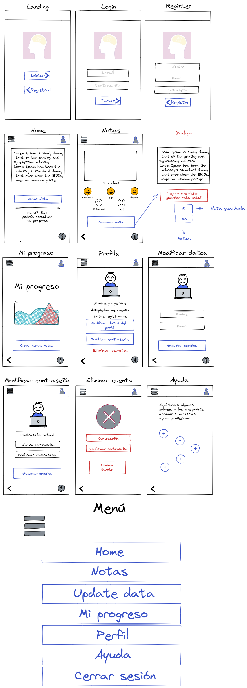
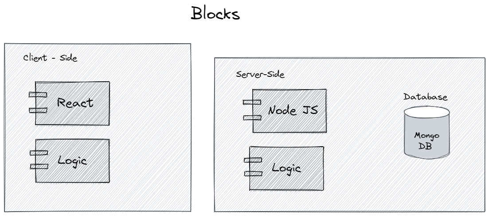
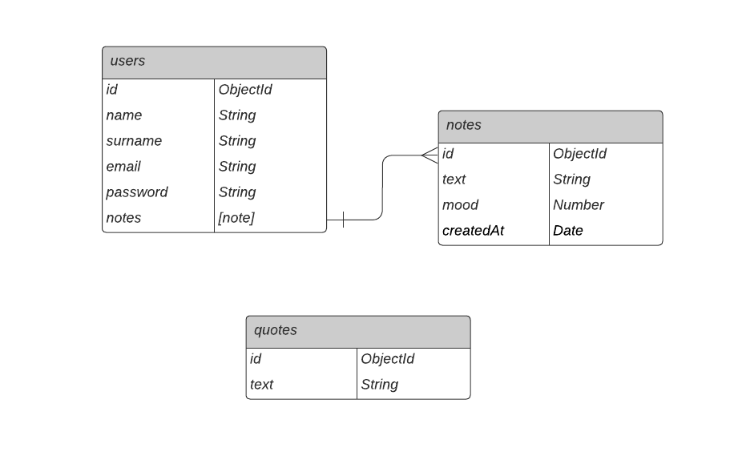

# Mind +

## 
Esta aplicacion esta enfocada en darle una visión realista al usuario acerca de su avance psicologico cuando esta inmerso en un momento de la vida en el cual su inteligencia emocional se ve deteriorada o inestable por diversas causas, permitira que de manera individual y en respuesta a sus experiencias en el dia a dia, pueda contrastar los cambios que se presentan en el mediano plazo, de esta manera atenderemos un proceso que en la gran mayoria de los pacientes se pasa alto, el hecho de que el avance para la mejora emocional si se esta llevando a cabo, pero no se logra percibir.

#
## Functional Description

 - Opcion de escribir una nota diaria referente a tu estado emocional o a como a pasado tu dia. 

 - Recibir una frase motivadora todos los dias.

 - Verificar tu progreso en un periodo de tiempo determinado.

 - Encontrar ideas acerca de ejercicios que ayudaran a que tu proceso sea mas optimo.

 - Encontrar ayuda con enlaces a centros especializados.

 - Tener acceso a notas guardadas despues de un tiempo determinado.

### Use Cases

### Flow Chart

#### User Interface (UI)
##### Main Views

## Technical Description

### Blocks

### Data Model

#### Schemas

user
- name (string, required, min length 2)
- username (string, required, min length)
- email (string, required, unique)
- password (string, required, min length 8)
- notes ([note])

note
- text (String, required, min length 10)
- mood (String, required)
- date (Date, required)

quotes
- text (String, required)

#### ER Diagram

## Tasks history

### Docs

- ~~DONE introduce the project, describe it (.5h)~~

#### Functional Description

- ~~DONE create use cases diagram (.25h)~~
  
- ~~DONE create wireframes in paper (2h)~~
- ~~DONE create wireframes in figma (alt excalidraw) (3h)~~
- ~~DONE create wireframes in README (images) (1h)~~

#### Techincal Description

- ~~DONE create blocks diagram (.5h)~~

- ~~DONE create data model in paper (1h)~~
- ~~DONE create data model in diagrams.net (E/R) (1h)~~
- ~~DONE create data model in README (images) (1h)~~

### Data

- ~~TODO create mongoose schemas and models (2h)~~
- ~~TODO create populate.js to test my models (1h)~~

### App

- ~~TODO create main views (components) (1h)~~
- ~~TODO mechanize navigations (.5h) -->~~