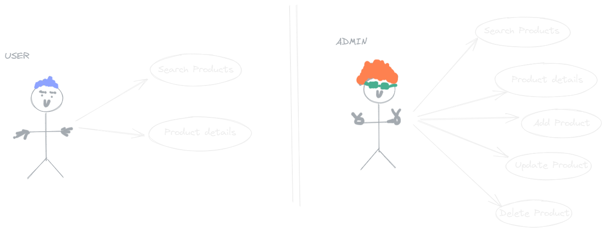
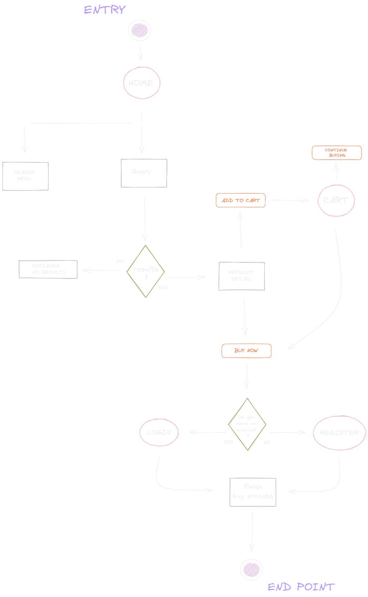
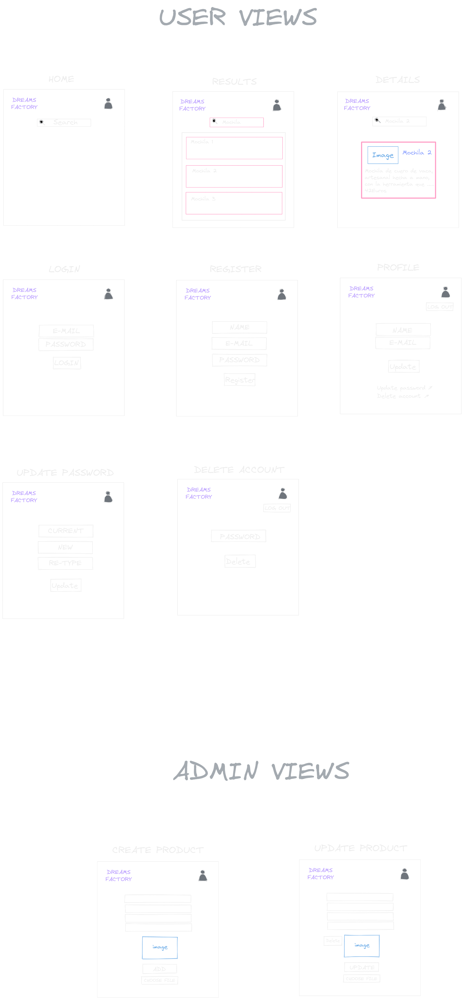
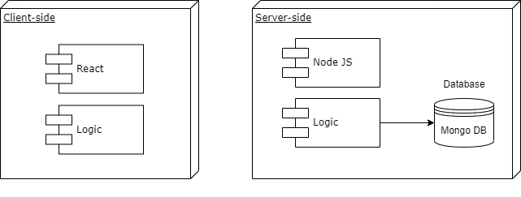
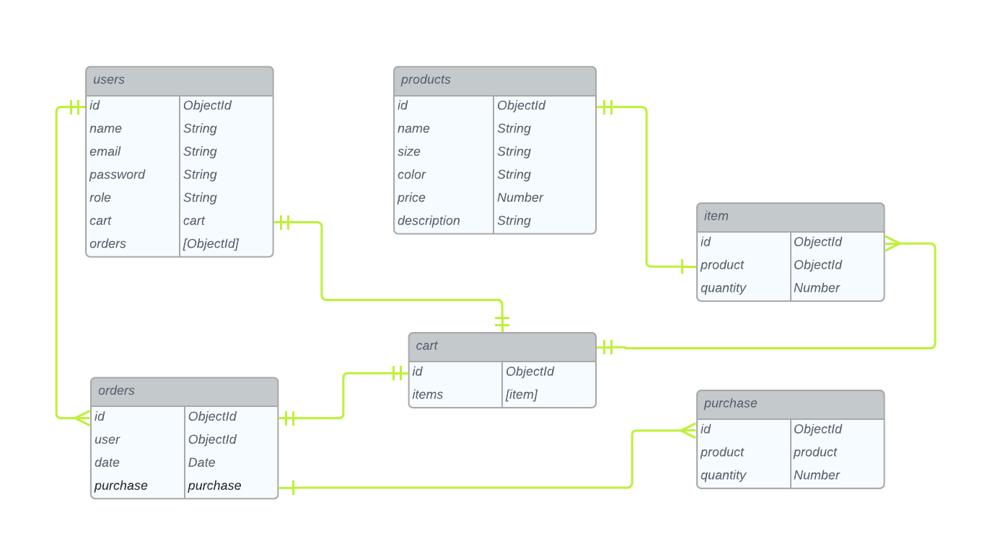
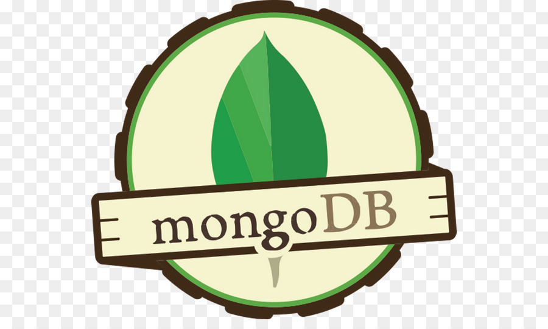

# Dreams Factory project

## Introduction

Dreams Factory is the first version of an e-commerce project, 
For who wanna buy an artisan product, original and hand made :)
Mainly there are artisan products like leather bags, necklaces, bracelets and lot of different
hand made products.

## Functional Description

### Activities 
As User you can:

- Search products
- See product details (construction material, measures, etc...)

And as Admin you can:

- Register product
- Update product
- Delete product
- Search products
- See product details

### Use cases

### Flows

### User Interface (UI)

## Technical Description

### Blocks

### Data Model

#### Schemas

user
- name {
    type: String,
    required: true,
    minlength: 2
},

- email{
    type: String,
        required: true,
        unique: true
    },

- password: {
        type: String,
        required: true,
        minlength: 8
    },

- role: {
        type: String,
        required: true,
        enum : ['user','admin']
    }

product
- name: {
        type: String,
        required: true
    },

- image: {
        type: String,
        required: true
    },

- size: {
        type: String,
        required: true
    },

- color: {
        type: String,
        required: true
    },

- price: {
        type: Number,
        required: true
    },

 - description: {
        type: String,
        required: true
    }

#### ER Diagram

### Dreams Factory 0.1 (Future version incoming....)

#### TODO's
Use cases as User:
- Add products to cart 
- Buy products

Use cases as Admin:
- view order list

### Technologies

