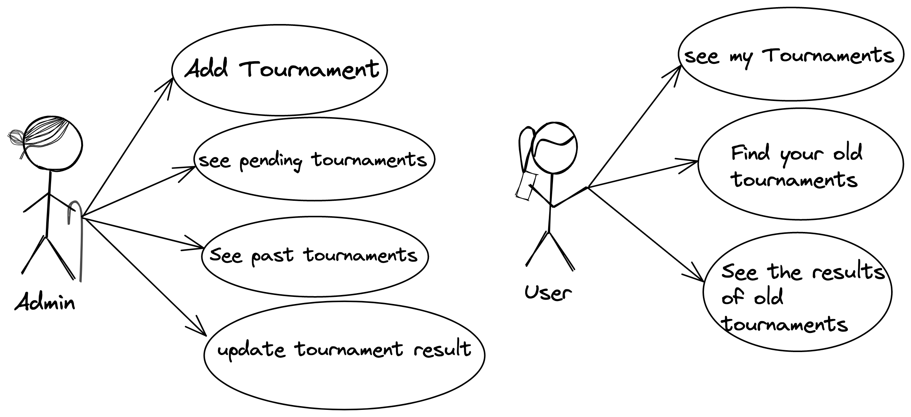
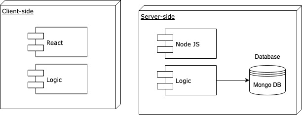
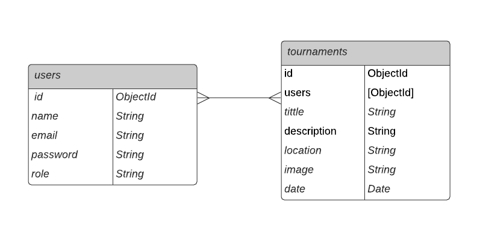

# TOPÁDEL

## Intro
<!-- TODO rebuild description -->
TOPÁDEL  is a padel tournament website. you can participate in tournaments created by the admin, and see your results.

## Funcional descripcion

### Activities

<!-- De primeras solo habrá un admin -->
<b>Admin:<b>
- Añadir torneo
- Ver sus torneos pendientes
- Ver torneos pasados
- Ver los torneos por celebrar de forma global
- Actualizar resultados de un toreno activo y creado por él mismo

<!-- los usuarios son apuntados por el admin en los torneos, ellos por sí mismo no pueden apuntarse ni pedir a través de la app que se les apunten -->

<b>User:<b>
- Ver lista de torneos en las que participa
- Buscar tus torneos antiguos
- Ver los resultados de torneos antiguos
- Ver el torneo actual activo

### Use Cases

### Flows
<!-- TODO rebuild -->

## technical Descripcion

### Blocks

### Data Model

#### Schemas

user
- name (string, required, min length 15)
- role: (string, 'admin' or 'user', default 'user')
- email (String, required, unique)
- password (string, required, min length 8)

tournament
- user (objectId)
- title (string)
- description (String, required)
- location (String, required)
- image (string)
- date (Date, required) 

#### E/R Diagram

<!-- Lista de prioridades

- ER diagram
- uses cases
- flows(vistas)
- data package 
_______________ Para mañana -------------------
- wireframes 
- review flows with ux/ui students

-->