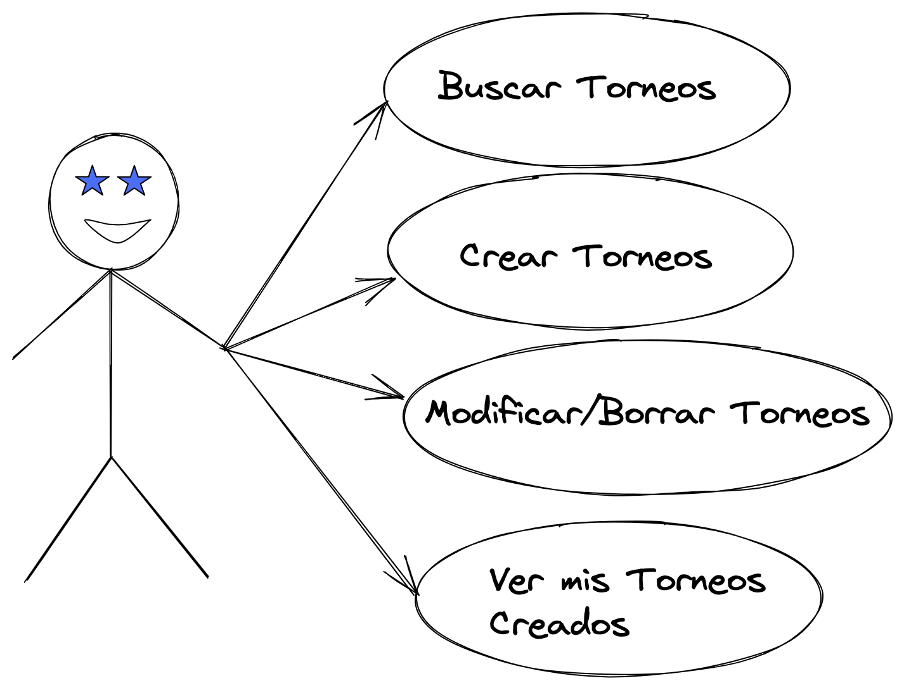
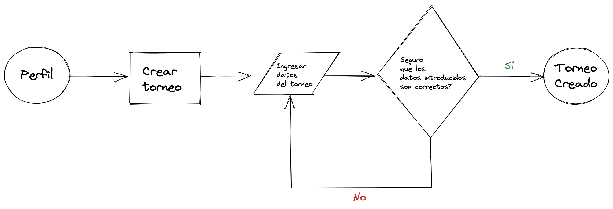
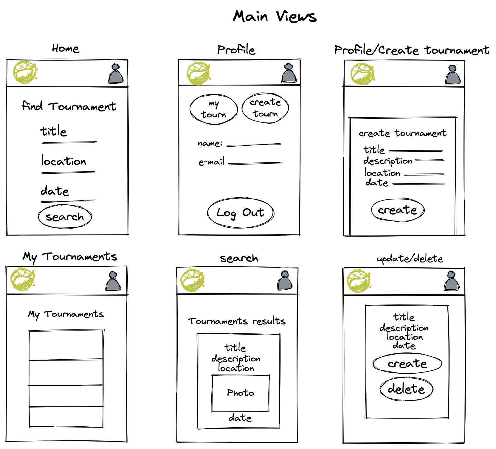

# TOPÁDEL

## Intro
<!-- TODO rebuild description -->
TOPÁDEL es una aplicación que decidí crear para mis amigos y yo. Como buenos aficionados al pádel, quedamos 2 o 3 veces por semana para jugar. Que mejor que crear los torneos en esta app y organizarnos mejor? :)

## Funcional descripcion

### Activities

- Crear Torneos 
- Modificar la información de los torneos creados(descripción, cuidad, fecha...)
- Buscar Torneos por Título, cuidad y día
- Ver los detalles de un torneo
- Borrar Torneos

### Use Cases

### Flows

## technical Descripcion

### Blocks

### Data Model

#### Schemas

user
- name (string, required, min length 15)
- role: (string, 'admin' or 'user', default 'user')
- email (String, required, unique)
- password (string, required, min length 8)

tournament
- user (objectId)
- title (string)
- description (String, required)
- location (String, required)
- image (string)
- date (Date, required) 

#### E/R Diagram

### TODO LIST
- Hacer Testing de Lógicas de server.
- Implementar un mejor feedback.
- Poder actualizar las fotos de los torneos.
- Añadir más funcionalidades para los usuarios: Inscribirse a Torneos y añadir favoritos.
