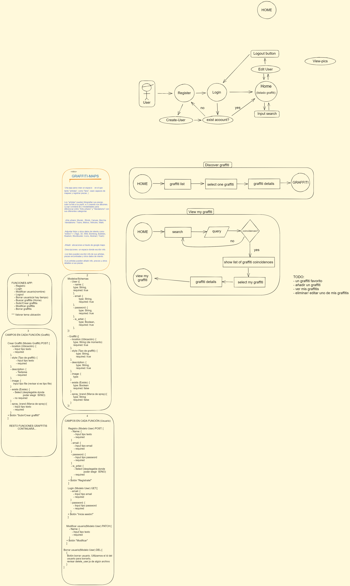

# Graffiti Maps

## Intro 
Una app para crear un espacio en el que
tanto "artistas", como "fans", sean capaces de 
mapear y registrar piezas ;)

Los "artistas" pueden fotografiar sus piezas,
subir la foto a su perfil, e ir creando sus álbumes.
La api constará de 2 modalidades para
diferenciar entre "Arte-urbano" y "Vandalismo" con
sus diferentes categorías 

 -Arte urbano: Murals , Blinds, Canvas, Mercha.
-Vandalismo: Trains, Metros, Vehicles, Walls. 

-Adjuntar fotos y otros datos de interés como 
"estilos"=> (Tags, 3D, Wild, Bombing, Bubbles, 
Realism, Blockbuster, Icons, Abstract, Trash)

-Añadir  ubicaciones a través de "google maps".

-Descripciones: un espacio donde escribir info.

-Los fans pueden escribir info de sus artistas, 
piezas encontradas y otros datos de interés.

//Los artistas pueden añadir info, precios u otros
detalles a sus piezas.

 

## Functional Description
TODO UML diagrams (use cases, flows, activities, etc)

### Use Cases

#### User Interface (UI)

##### Main Views

## Technical Description
TODO UML diagrams (blocks, components, data model (entity diagram), etc)

### Blocks

### Data Model

User
- name (string, required, min length 2)
- email (string, required, unique)
- password (string, required, min length 8)

Location
- title (string, required, ...)
- description (string, required, ...)
- address (string, required, ...)
- postal code (string, required, ...)
- coords ([integer, integer], required, ....)
- ...

Comment
- text
- date
- user
- location

## Tasks history

### Docs

- TODO introduce the project, describe it (.5h)

#### Functional Description

- TODO create use cases diagram (.25h)
  
- TODO create wireframes in paper (2h)
- TODO create wireframes in figma (alt excalidraw) (3h)
- TODO create wireframes in README (images) (1h)

#### Techincal Description

- TODO create blocks diagram (.5h)

- ~~TODO create data model in paper (1h)~~
- TODO create data model in diagrams.net (E/R) (1h)
- TODO create data model in README (images) (1h)

### Data

- TODO create mongoose schemas and models (2h)
- TODO create populate.js to test my models (1h)

### App

- TODO create main views (components) (1h)
- TODO mechanize navigations (.5h)