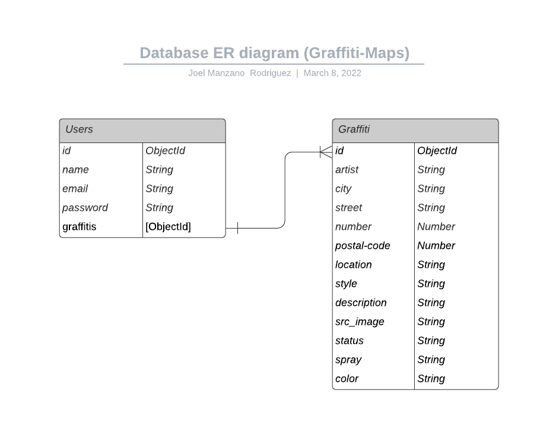

# Graffiti Maps

## Intro 

Una app para crear un espacio en el que
tanto "artistas", como "fans", sean capaces de 
mapear y registrar piezas ;)

- Arte urbano: Murals , Blinds, Canvas, Mercha.
- Vandalismo: Trains, Metros, Vehicles, Walls. 

- Adjuntar fotos y otros datos de interés como 
"estilos"=> (Tags, 3D, Wild, Bombing, Bubbles, 
Realism, Blockbuster, Icons, Abstract, Trash)

- Descripciones: un espacio donde escribir info.

- Los fans pueden escribir info de sus artistas, 
piezas encontradas y otros datos de interés.

- Añadir ubicaciones a través de "leaftlet maps" (future versión).

- Galería de arte urbano: Los artistas pueden añadir info, precios u otros
detalles a sus piezas (future versión).

## Functional Description

### Activities

- Añadir graffitis
- Editar graffitis
- Eliminar graffitis
- Listar graffitis según filtros
- Ver detalles de un graffiti
- Añadir a favoritos un graffiti

<!-- Encuentra, visita y comparte los graffitis de tu ciudad.
Los usuarios podrán compartir los graffitis que mas les gusten así como los suyos propios. Podrán compartir imagenes, descripciones, ubicaciones y otro tipo de información. Actualizar la información modificando sus publicaciones. -->

### Use Cases

### Flows

<!-- Revisar del tercero para abajo (no hacerlo mucho más complejo, solo más lógico) -->

#### User Interface (UI)

##### Main Views

 <=// añadir imagen; -->
<!-- Para mañana

## Technical Description

### Blocks

### Data Model

#### Schemas

 user
- name (string, required, min length 2)
- email (string, required, unique)
- password (string, required, min length 8)

graffiti
- user (object id)
- artist (string, not required)
- description (string, required, min/max_length 2/200)
- image (string, required)
- city (string, required)
- address (string, required)
- postalCode (string, not required)
- location (string, required)
- style (string, required, enum:['unkown', 'tags', '3d', 'bombing',   'bubbles', 'blockbuster', 'realism', 'icons', 'trash', 'abstract'],default:'unknown')
- status (string, required, enum:['exists', 'trampled', 'cleaned up'], default:'exists') 
- spray (string, not required)
- colors ([string], not required)

#### E/R Diagram

<!-- TODO:
data
wireframes
Review flows with UX/UI student
--> 