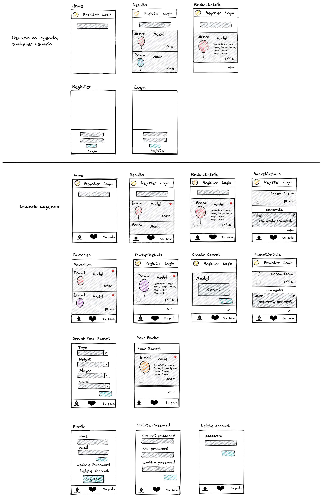

# Racketmatch

## Intro

<b>Racketmatch</b> es una aplicación web pensada para móviles que surgio de una necesidad muy común que hay en el mundo del padel; la busqueda de pala.

 Esta aplicación cumple dos funciones básicas: la primera es un buscador de palas genérico donde tu como usuario puedas buscar una pala segun su "marca"???. 
 
 Y por otro lado tendrá la función de <b> busca tu pala </b>donde el usuario tendrá que rellenar una encuesta y segun las caracteristicas que tenga y proporcione a la aplicación le dará una pala. Asi el jugador podrá tener una idea de que tipo de pala tiene que probar.

## Functional Description

#### User can do:

- Register and Login
- Modify Info
- Search rackets by brand
- View details of racket
- Search your Racket
- View details of racket
- Add to Fav list
- Add comment
- Delete comment
- Delete Account

### Use Cases

#### User Interface (UI)

##### Main Views

## Technical Description

### Blocks

### Data Model

User
- name (string, required, min length 2)
- email (string, required, unique)
- password (string, required, min length 8)

Racket
- Name (string, required, ...)
- Weigth (string, required, ...)
- Type of racket: (string, required)
- Type of play: (string, required)
- Nivel: (string, required)
- Description (string, required, ...)

Comment
- User: Object id 
- Text: string, required 
- Date: date, required

## Tasks history

### Docs

- TODO introduce the project, describe it (.5h)
- all it's okey

#### Functional Description (weekend)

- ~~TODO create use cases diagram (.25h)~~
- ~~TODO create wireframes in paper (1h)~~
- ~~TODO create wireframes in figma (alt excalidraw) (2h)~~
- ~~TODO create wireframes in README (images) (.25h)~~

#### Techincal Description (weekend)

- ~~TODO create blocks diagram (.5h)~~

- ~~TODO create data model in paper (1h)~~
- TODO create data model in diagrams.net (E/R) (1h)
- TODO create data model in README (images) (1h)

### Data (monday)
- TODO create mongoose schemas and models (2h)
- TODO create populate.js to test my models (1h)

### App (monday)
- TODO create main views (components) (1h)
- TODO mechanize navigations (.5h)