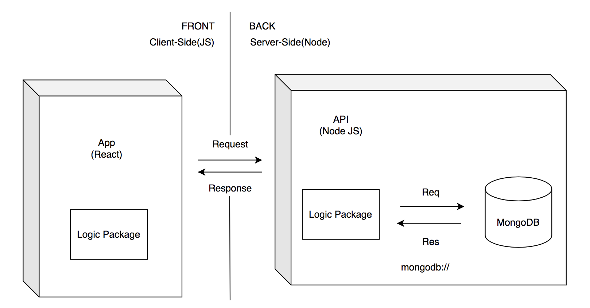

# Racketmatch

## Intro

<b>Racketmatch</b> es una aplicación web pensada para móviles que surgio de una necesidad muy común que hay en el mundo del padel; la busqueda de pala.

 Esta aplicación cumple dos funciones básicas: la primera es un buscador de palas genérico donde el usuario pueda buscar una pala segun su marca, el tipo de pala, el nivel de jugador y el modelo de pala. 
 
 Y por otro lado tendrá la función de <b> busca tu pala </b>donde el usuario tendrá que rellenar una encuesta y segun las caracteristicas que tenga y proporcione a la aplicación le dará una pala. Asi el jugador podrá tener una idea de que tipo de pala tiene que probar.

## Functional Description

#### User can do:

- Register and Login
- Modify Info
- Search rackets by brand
- View details of racket
- Search your Racket
- View details of racket
- Add to Fav list
- Add comment
- Delete comment
- Delete Account

### Use Cases

#### User Interface (UI)

##### Main Views

## Technical Description

### Tecnologies

- JavaScript
- Sass
- HTML
- React
- Node.JS
- Express
- MongoDB

### Blocks

### Data Model

#### Schemas

user 
- name : String
- email: String
- password : String
- favorite: [objectId]

brand
- name: String

racket
- brand: objectId
- model: String
- type: String
- weight : Number
- player: String
- price: Number
- nivel: String
- descripcion: String
- image: String
- comments: [ObjectId]

comment
- user: objectId
- title: String
- text: String
- date: Date

#### E/R Diagram

## Tasks history

### Docs

- ~~TODO introduce the project, describe it (.5h)~~

#### Functional Description 

- ~~TODO create use cases diagram (.5h)~~
- ~~TODO create wireframes in paper (.5h)~~
- ~~TODO create wireframes in figma (alt excalidraw) (2h)~~
- ~~TODO create wireframes in README (images) (.25h)~~

#### Techincal Description 

- ~~TODO create blocks diagram (.5h)~~
- ~~TODO create data model in paper (1h)~~
- ~~TODO create data model in diagrams.net (E/R) (1h)~~
- ~~TODO create data model in README (images) (1h)~~

### Data 
- ~~TODO create mongoose schemas and models (2h)~~
- ~~TODO create populate.js to test my models (1h)~~
- ~~TODO validaciones schemasmas + reales~~

### API (weekend)
- ~~TODO handlers ~~
- ~~ TODO test Insomnia~~

### App 
- ~~TODO logic~~
- ~~TODO create main views (components) (1h)~~
- ~~TODO mechanize navigations (.5h) ~~

## Versión 2.0
- Testing
- FeedBack
- Password 
- Apliar base de datos
- Scrap news 
