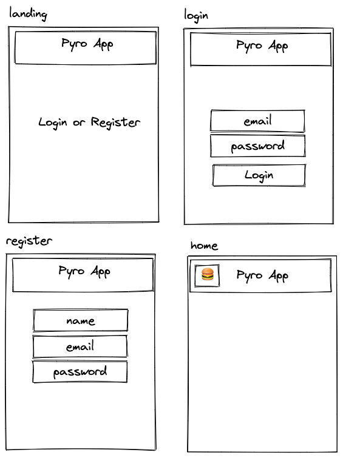

# Pyro Project

## Intro

## Functional Description

### Use Cases

#### User Interface (UI)

##### Main Views

## Technical Description

### Blocks

### Data Model

User
- name (string, required, min length 2)
- email (string, required, unique)
- password (string, required, min length 8)

Location
- title (string, required, ...)
- description (string, required, ...)
- address (string, required, ...)
- coords ([integer, integer], required, ....)
- ...

Comment
- text
- date
- user
- location

## Tasks history

### Docs

- TODO introduce the project, describe it (.5h)

#### Functional Description

- TODO create use cases diagram (.25h)
  
- TODO create wireframes in paper (2h)
- TODO create wireframes in figma (alt excalidraw) (3h)
- TODO create wireframes in README (images) (1h)

#### Techincal Description

- TODO create blocks diagram (.5h)

- ~~TODO create data model in paper (1h)~~
- TODO create data model in diagrams.net (E/R) (1h)
- TODO create data model in README (images) (1h)

### Data

- TODO create mongoose schemas and models (2h)
- TODO create populate.js to test my models (1h)

### App

- TODO create main views (components) (1h)
- TODO mechanize navigations (.5h)