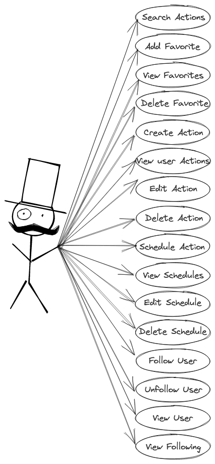
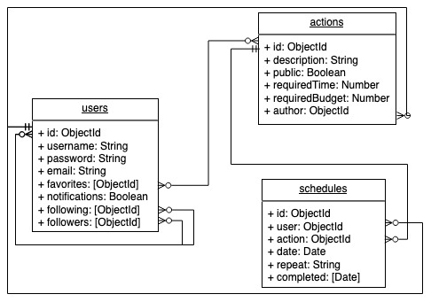

# beHooman

## Intro
----

BeHooman es una aplicación que busca crear una comunidad para compartir, crear e incentivar las buenas acciones que podemos hacer cada día por otros y por el planeta, de forma desinteresada y recordándonos ser más humanos cada día. 

## Functional Description
---
- Ver la lista completa de Acts (buenas acciones)
- Filtrar buenas acciones, según tiempo requerido, dinero requerido, oficiales beHooman y publicadas por otros usuarios
- Añadir buenas acciones a su lista de favoritas
- Elminar buenas acciones de su lista de favoritas
- Crear buenas acciones propias, configurarlas para que sean privadas o públicas para incluirlas en la lista pública disponible
- Modificar las buenas acciones que ha creado
- Eliminar las buenas acciones que ha creado
- Agendar las buenas acciones de cada día
- Configurar las notificaciones a recibir
- Agregar otros usuarios a sus lista de amigos
- Ver el perfil de sus amigos
- Eliminar amigos
- Compartir buenas acciones con sus amigos

### Use Cases

### Flow Charts

#### Schedule Act

#### Create Act

#### Add Favorite

## Technical Description
---

### Blocks

### Data Model

### Technologies
- Javascript
- React
- CSS
- HTML
- Express
- Mongo
- Node

## User Interface (UI)
___

### Main Views

------------------------------------

# TASK LIST

## Docs
- ~~TODO introduce the project, describe it (.5h)~~

### Functional Description
- ~~TODO create use cases diagram (.25h)~~
  
- TODO create wireframes in paper (2h)
- TODO create wireframes in figma (alt excalidraw) (3h)
- TODO create wireframes in README (images) (1h)

### Techincal Description

- ~~TODO create blocks diagram (.5h)~~

- ~~TODO create data model in paper (1h)~~
- ~~TODO create data model in diagrams.net (E/R) (1h)~~
- ~~TODO create data model in README (images) (1h)~~

### Data

- TODO create mongoose schemas and models (2h)
- TODO create populate.js to test my models (1h)

### App

- TODO create main views (components) (1h)
- TODO mechanize navigations (.5h)

- acts: contar las veces que ha sido favorita para mostrar por popularidad en el home