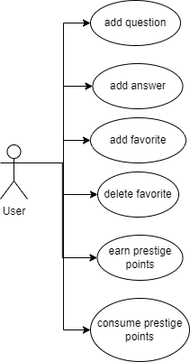
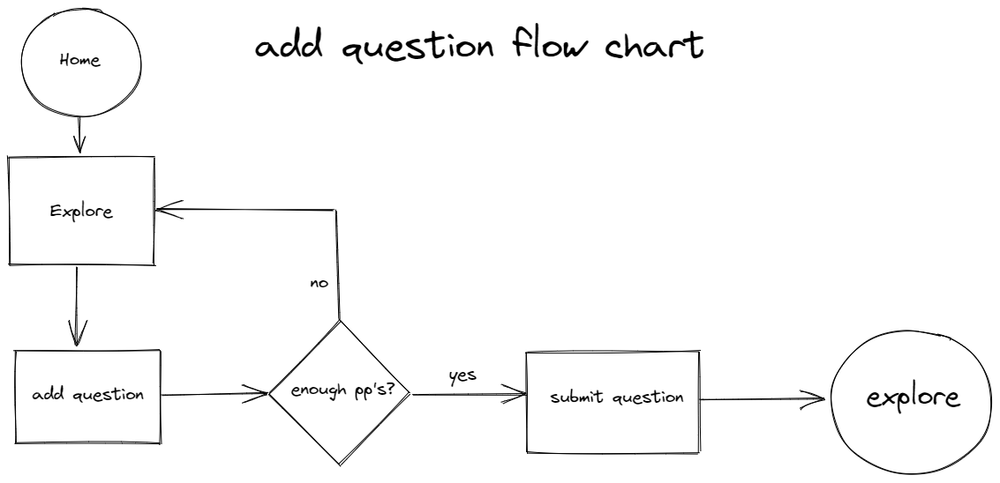
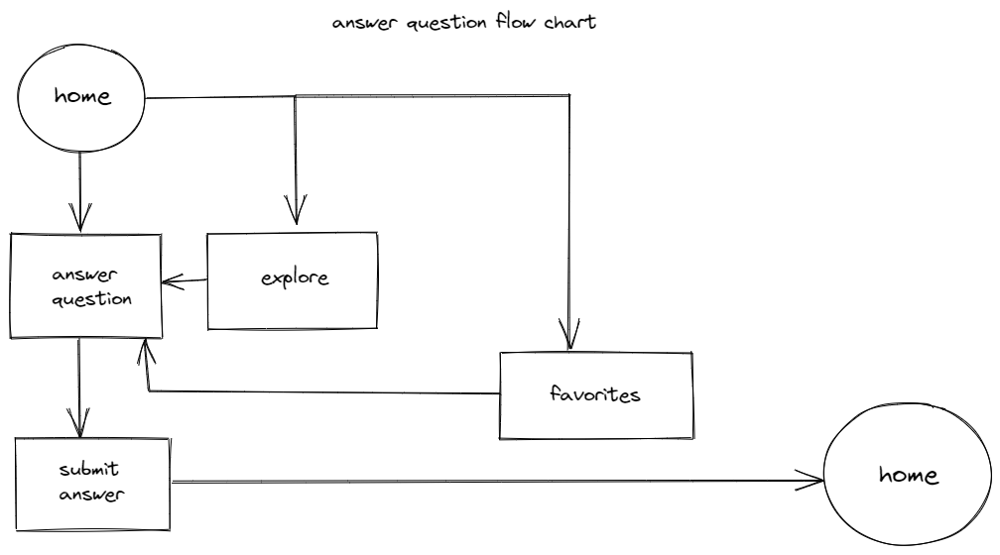
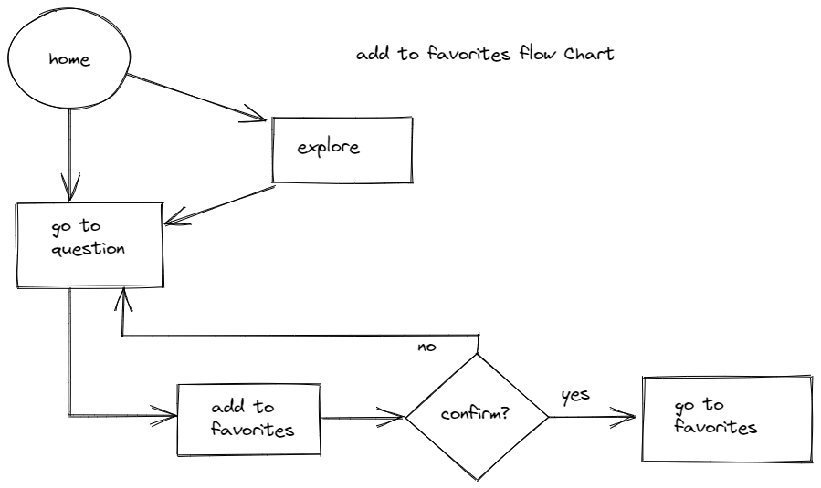
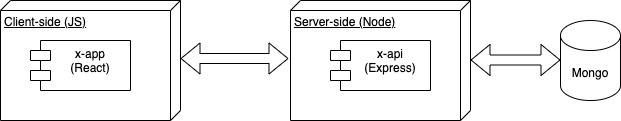
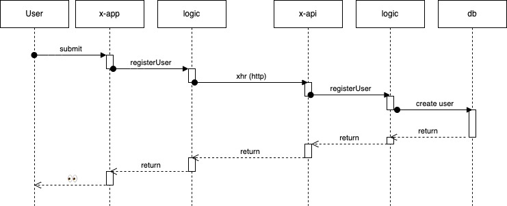
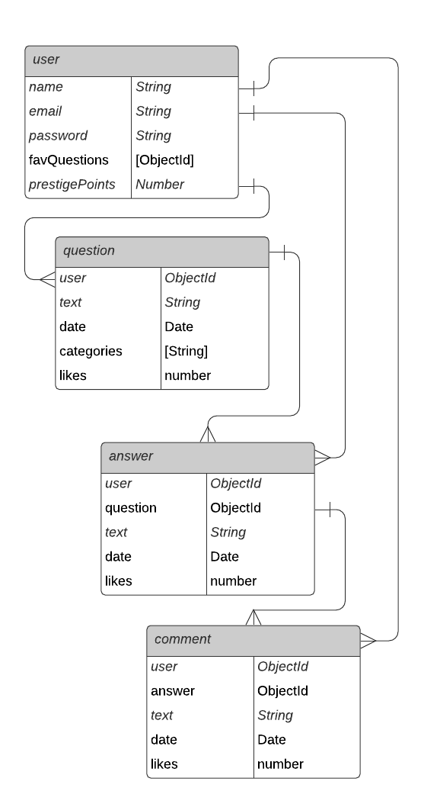

# thyLemma

## Intro

Ask & answer questions about philosophy while building prestige points.
In this app the user can post questions about philosophy, answer other users' questions and get prestige points while doing it. Prestige points will be needed to post your own questions. The user can also save their favorite questions to their "favorites" section and delete them as well.

## Functional Description

### Activities

- Add questions using prestige points
- add answers to questions posted by other users or by yourself
- add questions to favorites 
- delete questions from the 'favorites' section
- get prestige points by getting liked and reposted on the page
- consume prestige points by asking questions

### Use Cases

#### add question

#### add answer 

#### add to favorites

#### User Interface (UI)
<!-- TODO finish wireframes and link to docs -->
##### Main Views

## Technical Description

### Blocks

### Sequences

#### Register User

### Data Model

#### Schemas

 user
- name (string, required, min length 2)
- email (string, required, unique)
- password (string, required, min length 8)
- favQuestions ([object id], )
- prestigePoints (number, required)

question
- user (object id, required, unique)
- text (string)
- date (date)
- categories ([string])
- likes (number)

answer
- user (object id, required, unique)
- question (object id, required, unique)
- text (string)
- date (date, required)
- likes (number)

comment
- user (object id, required, unique)
- answer (object id, required, unique)
- text (string)
- date (date)
- likes (number)

<!-- TODO
ER diagram
Review with Ventu
Description
Link blocks
Link uses cases
List of functional description
Flows (post question, post comment, add favorites)
Wireframes
Review with ux/ui student -->
