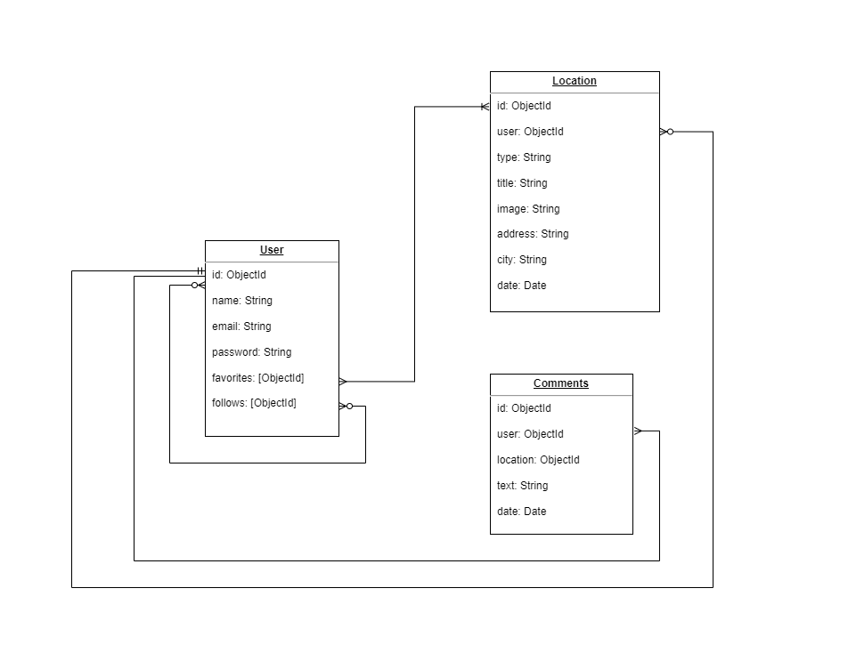

# Dogether Project

## Intro

Esta aplicación esta creada para facilitar la búsqueda de localizaciones en donde puedes acceder con tu compañero peludo. Ya sea restaurantes, bares, hoteles, playas.. etc.

Gracias a la creación de una preciosa comunidad, entre todos podremos descubir y compartir sitios *pet-friendly*.

## Functional Description

- Buscar localizaciones pet-friendly.
- Crear nuevas localizaciones encontradas.
- Comentar localizaciones de otros usuarios.
- Guardar localizaciones favoritas.
- Seguir a otros usuarios.

### Use Cases

### Flow Chart

#### User Interface (UI)

##### Main Views

## Technical Description

### Blocks

### Data Model

### Tecnologies

- JavaScript
- CSS
- HTML
- React
- Node.JS
- Express
- MongoDB

## Tasks history

##### Data

- DOING populate.js to test my models in populate.js

##### Logic

- TODO ... ()

##### API

- TODO ... ()

#### Client

##### App

- TODO create main views (components) (1h)
- TODO mechanize navigations (.5h)

##### Logic

- TODO ... ()
