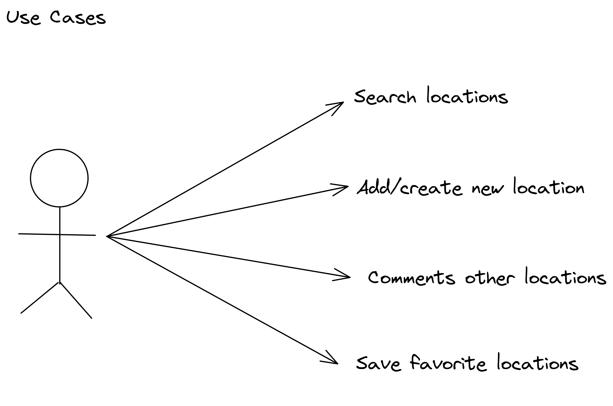
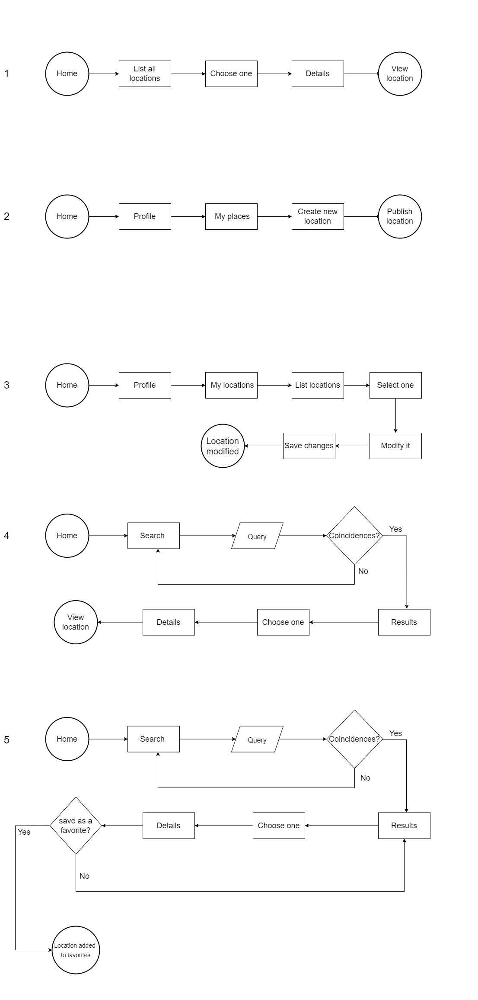
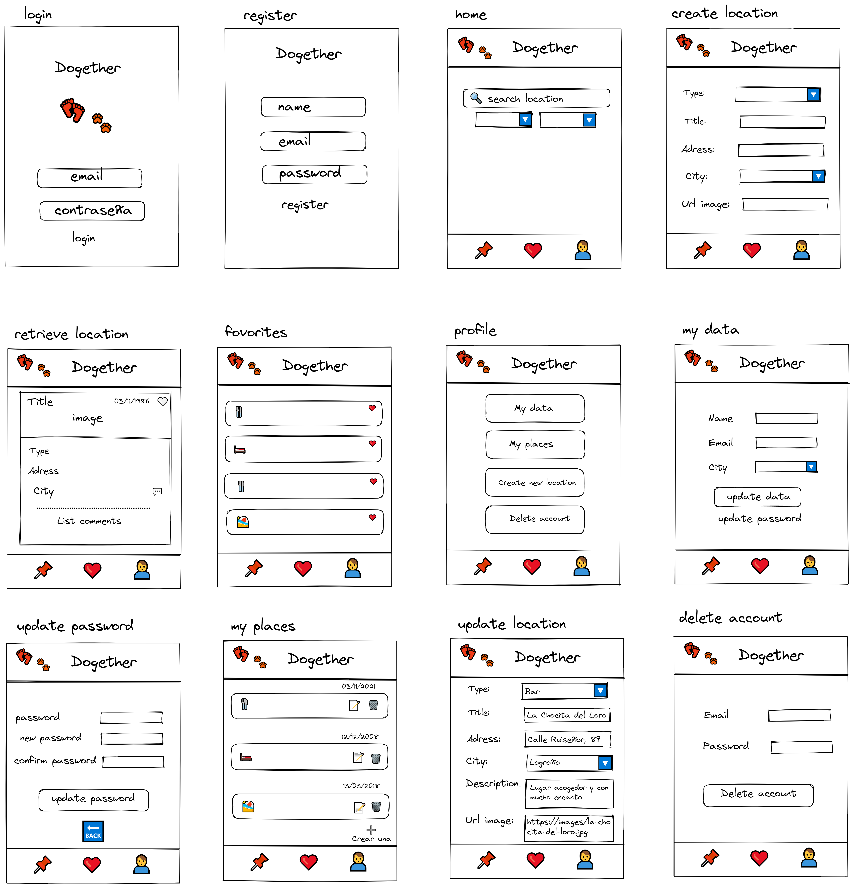

# DOGether Project

## Intro

Esta aplicación esta creada para facilitar la búsqueda de localizaciones en donde puedes acceder con tu compañero peludo. Ya sea restaurantes, bares, hoteles, playas.. etc.

Gracias a la creación de una preciosa comunidad, entre todos podremos descubir y compartir sitios *pet-friendly*.

## Functional Description

- Buscar localizaciones pet-friendly.
- Crear nuevas localizaciones encontradas.
- Comentar localizaciones de otros usuarios.
- Guardar localizaciones favoritas.

### Use Cases

### Flow Chart

#### User Interface (UI)

##### Main Views

## Technical Description

### Blocks

### Data Model

#### Schemas
user
- name: (String, required)
- email: (String, required, unique)
- password: (String, required)
- favorites: ( [ObjectId, Location] )  

location
- user: (ObjectId, User, required, unique)
- type: (String, required, enum)
- title: (String, required)
- image: (String)
- address: (String, required)
- city: (String, required, enum)
- date: (Date, required, default: Date.now)

comment
- user: (ObjectId, User, required)
- location: (ObjectId, Location, required)
- text: (String, required)
- date: (Date, required, default: Date.now)
   

### Tecnologies

- JavaScript
- CSS
- HTML
- React
- Node.JS
- Express
- MongoDB
- Sass

### Task list

- Añadir lista de seguidores
- Mejorar los alerts a realistas
- Mejorar SASS
- Hacer testing
- Poner feedback
- Poner bonito el home

