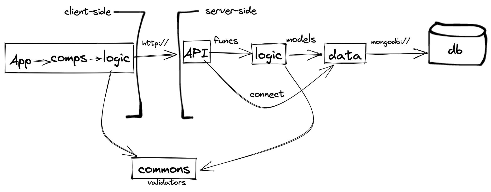

# DEMO project

blah blah blah

# Functional Description

## Use Cases

### Create note

- click on `create` button
- opens a new panel to add a note
- add text to the input (textarea)
- select a color from color list
- click on `add` button
- show feedback `note created`

### List notes

- click on `my notes` button
- opens a new panel with the note list
- each note has its text and its color

### Update note

- click on `edit` button from showing note (ex: from note list)
- opens the note panel (editor)
- change text in the input (textarea)
- change color from color list (select)
- click on `save` button

...

# Techincal Description

## Packages

